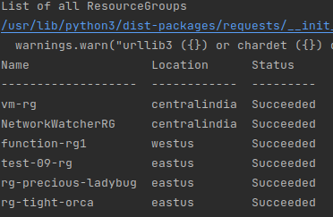
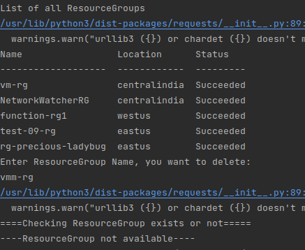
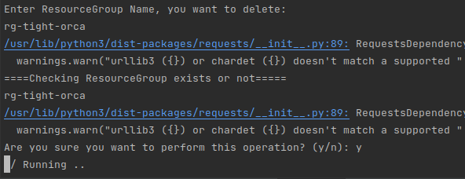
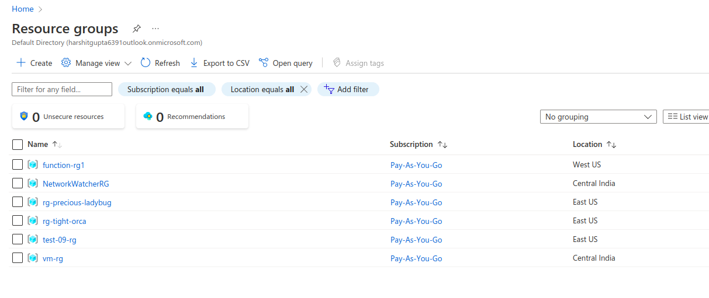
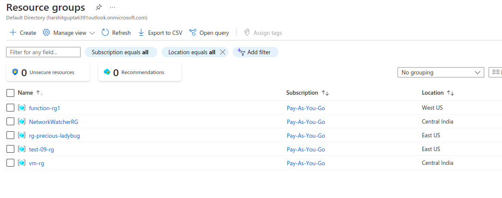

## Description

Here, In this template we will delete the Resource Group of Azure using the shell script.

---

#### Pre-requisite

* AZ Account
* Azure CLI

---

### Steps:-
1. Login into AZ account using `az login` or `az login --tenant <TENANT-ID>`
2. Change the permission of the file `chmod a+x change-vm-state.sh`
3. Go to the terminal and run the command `./delete-resource-group.sh`

---

### Outputs
* Here, In this output it's showing the list of Resource group's :

* Here, In thid output it's checking for the resource group available or not:

* Here, In this output it's deleting the resource group :

* Before deleting the resource group list on Azure Cloud:

* After deleting the resource group list on Azure Cloud:

---
